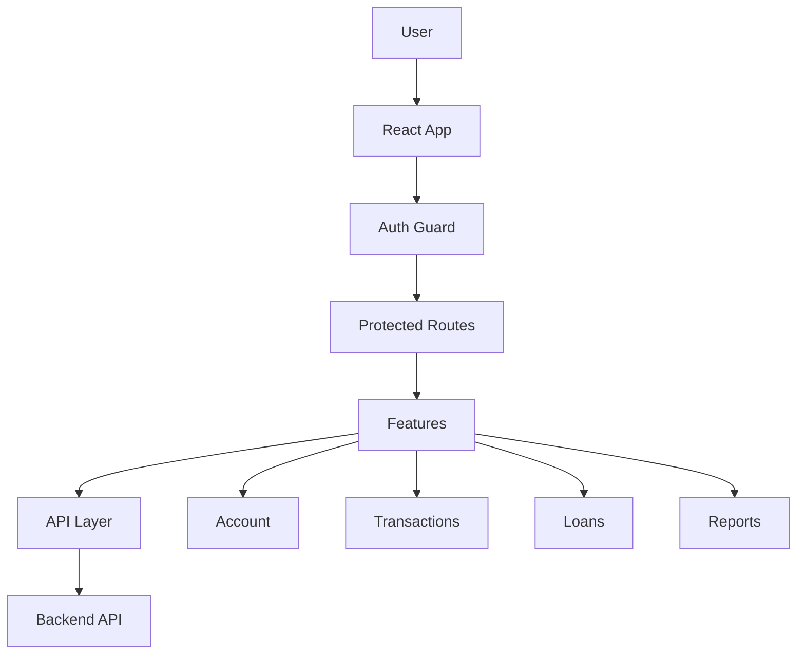

<div align="center">

# 🏦 Estebanquito

### Modern Banking Application Frontend

A feature-rich React banking platform for managing accounts, transactions, loans, and financial insights with modern UX design.

[](https://react.dev/)
[](https://vitejs.dev/)
[](https://www.typescriptlang.org/)
[](https://tailwindcss.com/)
[](LICENSE)

[Live Demo](https://jhonhander.github.io/estebanquito-front/) · [Report Bug](https://github.com/JhonHander/estebanquito-front/issues) · [Request Feature](https://github.com/JhonHander/estebanquito-front/issues)

</div>

---

## ✨ Features

- **Authentication** — Secure JWT-based login and registration
- **Account Management** — Real-time balance, transaction history, and profile
- **Transactions** — Deposit, withdraw, and transfer funds seamlessly
- **Loan System** — Apply for and manage loans
- **Financial Reports** — Track income, expenses, and debts with visual insights
- **Modern UI** — Built with Tailwind CSS, Radix UI, and Framer Motion
- **Protected Routes** — Secure navigation with authentication guards

## 🚀 Quick Start

```bash
# Clone the repository
git clone https://github.com/JhonHander/estebanquito-front.git
cd estebanquito-front

# Install dependencies
npm install

# Configure environment (see Environment section below)
cp src/.env.development .env.development

# Start development server
npm run dev
```

Visit `http://localhost:5173` to see the app in action.

## 🛠️ Tech Stack

<table>
<tr>
<td>

**Frontend**
- React 18
- TypeScript
- Vite

</td>
<td>

**Styling**
- Tailwind CSS 4
- Radix UI
- Framer Motion

</td>
<td>

**State & Routing**
- React Router v6
- React Context
- JWT Auth

</td>
</tr>
</table>

**Additional Libraries:** Axios · Recharts · Lucide Icons · TanStack Table

## 📁 Architecture

```
src/
├── features/          # Feature modules (auth, transactions, loans, reports)
│   ├── auth/         # Authentication logic & components
│   ├── account/      # Account management
│   ├── transactions/ # Transaction operations
│   ├── loans/        # Loan management
│   └── reports/      # Financial reporting
├── shared/           # Shared resources
│   ├── api/         # API client & services
│   ├── ui/          # Reusable components
│   └── lib/         # Utilities & helpers
├── routes/          # Route configuration & guards
└── app/             # Application setup & providers
```

**Design Pattern:** Feature-based architecture with clear separation of concerns



## ⚙️ Environment Setup

Create `src/.env.development` file:

```env
VITE_API_BASE_URL=http://localhost:3000/api
VITE_APP_NAME=Estebanquito
VITE_APP_VERSION=1.0.0
```

| Variable | Description | Required |
|----------|-------------|----------|
| `VITE_API_BASE_URL` | Backend API endpoint | ✅ Yes |
| `VITE_APP_NAME` | Application name | Optional |
| `VITE_APP_VERSION` | Version identifier | Optional |

> **Note:** All environment variables must be prefixed with `VITE_` to be accessible in the app.

## 📜 Available Scripts

```bash
npm run dev          # Start development server (localhost:5173)
npm run build        # Build for production
npm run preview      # Preview production build
npm run lint         # Run ESLint
npm run deploy       # Deploy to GitHub Pages
```

## 🎨 Code Style & Conventions

- **Path Aliases** — Use `@features`, `@shared`, `@app` for clean imports
- **TypeScript** — Type-safe code with strict mode enabled
- **Component Structure** — Organized by feature with api/ui/model separation
- **Naming** — Clear, descriptive names following React conventions

```typescript
// Example: Clean imports with path aliases
import { useAuth } from '@features/auth';
import { Button } from '@shared/ui/Button';
import { ROUTES } from '@shared/config/constants';
```

## 🔒 Security

- JWT token-based authentication with session storage
- Protected routes with authentication guards
- Environment-based configuration (no hardcoded secrets)
- Input validation and XSS protection
- Secure API communication with Axios interceptors

## 🤝 Contributing

Contributions are welcome! This is a learning project, so feel free to:

1. Fork the repository
2. Create a feature branch (`git checkout -b feature/amazing-feature`)
3. Commit your changes (`git commit -m 'Add amazing feature'`)
4. Push to the branch (`git push origin feature/amazing-feature`)
5. Open a Pull Request

## 📄 License

This project is licensed under the MIT License. See [LICENSE](LICENSE) file for details.

---

<div align="center">

**Built with ❤️ using React, TypeScript, and Tailwind CSS**

⭐ Star this repo if you find it helpful!

</div>
