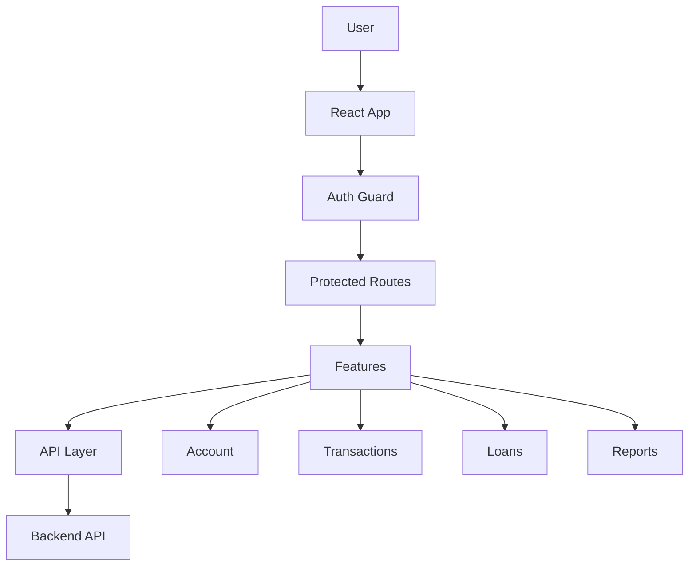

# Estebanquito

A modern React banking application for managing accounts, transactions, loans, and financial reports with a clean, professional interface.

[](https://react.dev/)
[](https://vitejs.dev/)
[](https://www.typescriptlang.org/)
[](https://tailwindcss.com/)
[](LICENSE)

**[Live Demo](https://jhonhander.github.io/estebanquito-front/) · [Report Bug](https://github.com/JhonHander/estebanquito-front/issues) · [Request Feature](https://github.com/JhonHander/estebanquito-front/issues)**

## Features

- **Authentication** — Secure JWT-based login and registration
- **Account Management** — Real-time balance, transaction history, and profile  
- **Transactions** — Deposit, withdraw, and transfer funds seamlessly
- **Loan System** — Apply for and manage loans with reporting
- **Financial Reports** — Track income, expenses, and debts with visual insights
- **Protected Routes** — Secure navigation with authentication guards
- **Modern UI** — Built with Tailwind CSS, Radix UI, and responsive design

## Quick Start

```bash
# Clone the repository
git clone https://github.com/JhonHander/estebanquito-front.git
cd estebanquito-front

# Install dependencies
npm install

# Start development server
npm run dev
```

Visit `http://localhost:5173` to see the app in action.

Environment is pre-configured in `src/.env.development`. Update `VITE_API_BASE_URL` if your backend runs on a different port.

## Tech Stack

| Frontend | Styling | State & Routing |
|----------|---------|-----------------|
| React 18 | Tailwind CSS 4 | React Router v6 |
| TypeScript | Radix UI | React Context |
| Vite | Framer Motion | JWT Auth |

**Additional:** Axios, Recharts, Lucide Icons, TanStack Table

## Project Structure

```
src/
├── features/          # Feature modules (auth, transactions, loans, reports)
│   ├── auth/         # Authentication logic & components
│   ├── account/      # Account management
│   ├── transactions/ # Transaction operations
│   ├── loans/        # Loan management
│   └── reports/      # Financial reporting
├── shared/           # Shared resources
│   ├── api/         # API client & services
│   ├── ui/          # Reusable components
│   └── lib/         # Utilities & helpers
├── routes/          # Route configuration & guards
└── app/             # Application setup
```

### Architecture

The application uses a **feature-based architecture** with clear separation of concerns. Each feature is self-contained with its own API services, models, and UI components.



## Configuration

Create `src/.env.development`:

```env
VITE_API_BASE_URL=http://localhost:3000/api
VITE_APP_NAME=Estebanquito
VITE_APP_VERSION=1.0.0
```

All environment variables must be prefixed with `VITE_` to be accessible in the app.

| Variable | Description |
|----------|-------------|
| `VITE_API_BASE_URL` | Backend API endpoint |
| `VITE_APP_NAME` | Application name |
| `VITE_APP_VERSION` | Version identifier |

## Scripts

```bash
npm run dev          # Start development server (localhost:5173)
npm run build        # Build for production
npm run preview      # Preview production build
npm run lint         # Run ESLint
npm run deploy       # Deploy to GitHub Pages
```

## Code Style

- **Path Aliases** — Use `@features`, `@shared`, `@app` for clean imports
- **TypeScript** — Type-safe code with strict mode enabled
- **Component Organization** — Feature-based with api/ui/model separation
- **Naming Conventions** — Clear, descriptive names following React patterns

```typescript
import { useAuth } from '@features/auth';
import { Button } from '@shared/ui/Button';
import { ROUTES } from '@shared/config/constants';
```

## Security

- JWT token-based authentication with secure session storage
- Protected routes with automatic authentication guards
- Environment-based configuration (no hardcoded secrets)
- Input validation and XSS protection
- Secure API communication with Axios interceptors

## Contributing

Contributions are welcome! To contribute:

1. Fork the repository
2. Create a feature branch: `git checkout -b feature/your-feature`
3. Commit your changes: `git commit -m 'Add your feature'`
4. Push to the branch: `git push origin feature/your-feature`
5. Open a Pull Request

## License

MIT License. See [LICENSE](LICENSE) file for details.

---

Built with React, TypeScript, and Tailwind CSS
